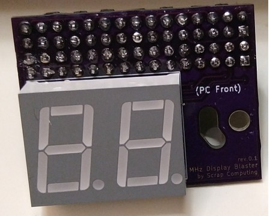
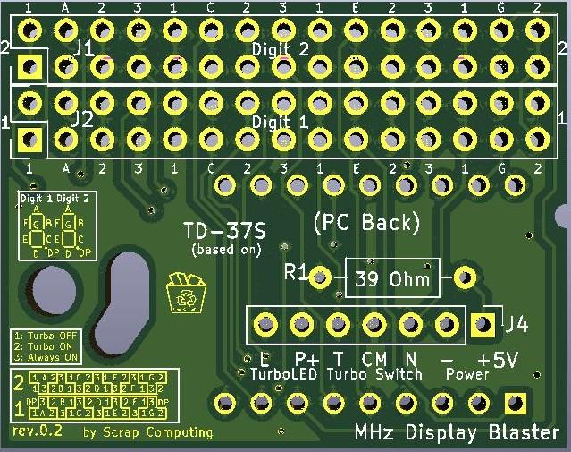
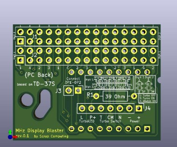
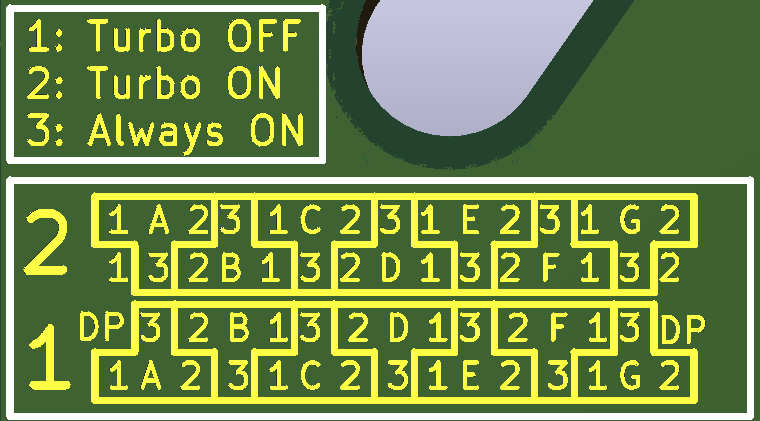

# MHz Display Blaster

A clone of the TD-37S 2-digit MHz display that was common in 386/486 PC cases.
It can display a Turbo and a non-Turbo number, depending on the state of the Turbo switch.
It also drives the Turbo LED accordingly.

# Assembly Tips
- Video showing the assembly of rev.0.1 PCB: https://www.youtube.com/watch?v=a4iVehn7APU
> **Warning**
> Please solder the single-row header and the resistor *before* you solder the 7-segment display

# Connecting the board to the PC
- Power: The display is powered by providing 5V to the `+` pin of J4 and GND to the `-` pin.
- Turbo Switch: The turbo switch is a 3-pin 2-way switch. Connect the common wire (middle) to `CM`, the Turbo-ON wire to `T` and the Turbo-OFF wire to `N` (J4).
- Turbo LED: The turbo LED is connected to `L` and `P` on J4. `P` is the positive.

# Display Configuration
- Each segment of the 7-segment display is configured individually with a jumper
- Each segment corresponds to a pin in the configuration headers
- You can short that pin with one of the neighboring state pins (forming a `T` shape) to set its state, which can be one of the following:
  1. ON when Turbo switch is OFF (jumper to position 1)
  2. ON when Turbo switch is ON (jumper to position 2)
  3. Always ON (jumper to position 3)
  4. Always OFF (no jumper)

> **Note**
> Please note that the PCB is often mounted up side down on the case.

- For a simple tutorial on how to set it up please refer to the video: https://www.youtube.com/watch?v=wNkg-e47Ex8
- [More resources on MHz Displays](https://www.minuszerodegrees.net/led_speed_display/led_speed_display.htm)

# Bill of materials

Gerber files are published in the releases: https://github.com/scrapcomputing/MHzDisplayBlaster/releases

Reference      | Quantity| Value    | Footprint/Comments
---------------|---------|----------|----------
U1             | 1       |(e.g., LTD-6440G) | 18-DIP (0.600", 15.24mm distance between top and bottom row pins) 2-Digit 7-Segment Display Common Cathode 0.56" Green
J1 J2          | 2       |Conn_02x15| Connector Male PinHeader 2x15 P2.54mm Vertical
J4             | 1       |Conn_01x06| Connector Male PinHeader 1x06 P2.54mm Vertical
Jumpers        | 15      |          | 2.54mm pitch jumpers

# Changelist
- Rev.0.2 : Fixes polarity issue, improves info
- Rev.0.1 : Initial revision
